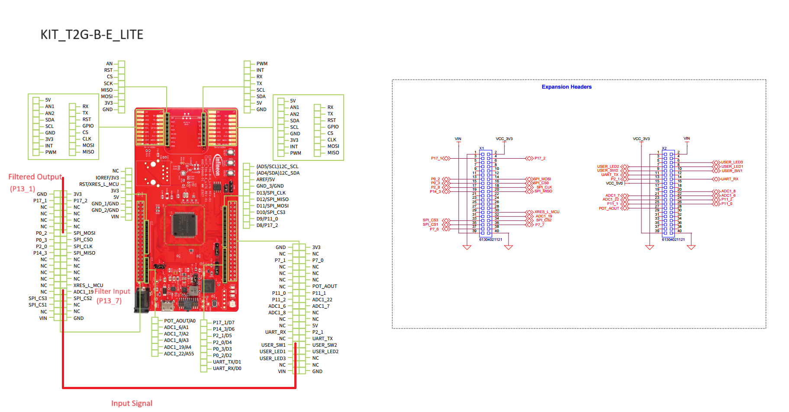
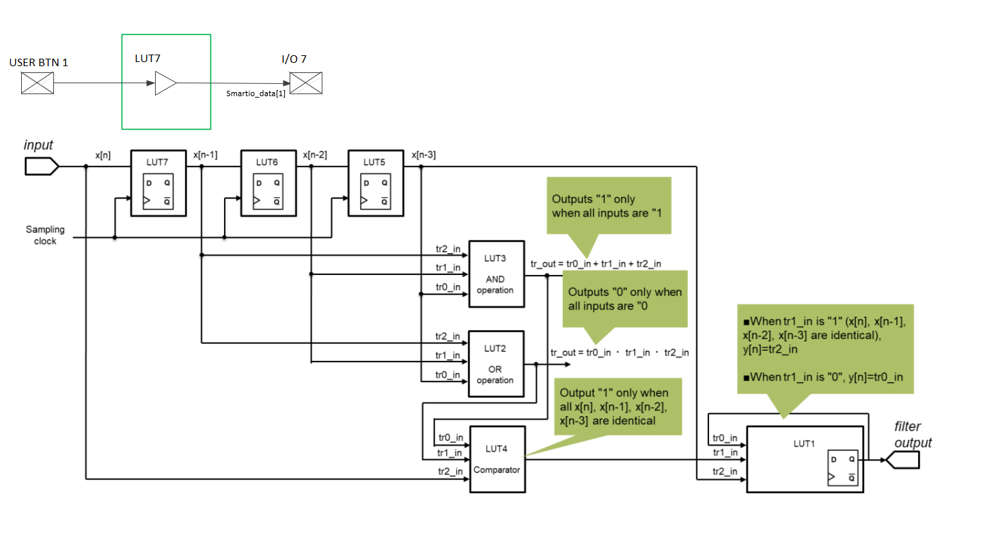

# SMART IO Glitch Filter
**This code example shows how to configure the glitch filter using Smart I/O functionality.** 

## Device
The device used in this code example (CE) is:
- [TRAVEO™ T2G CYT4BF Series](https://www.infineon.com/cms/en/product/microcontroller/32-bit-traveo-t2g-arm-cortex-microcontroller/32-bit-traveo-t2g-arm-cortex-for-body/traveo-t2g-cyt4bf-series/)
- [TRAVEO™ T2G CYT2BL Series](https://www.infineon.com/cms/en/product/microcontroller/32-bit-traveo-t2g-arm-cortex-microcontroller/32-bit-traveo-t2g-arm-cortex-for-body/traveo-t2g-cyt2bl-series/)

## Board
The board used for testing is:
- TRAVEO&trade; T2G evaluation kit ([KIT_T2G-B-H_EVK](https://www.infineon.com/cms/en/product/evaluation-boards/kit_t2g-b-h_evk/))
- TRAVEO&trade;  T2G Body Entry Lite evaluation kit ([KIT_T2G-B-E_LITE](https://www.infineon.com/cms/en/product/evaluation-boards/kit_t2g-b-e_lite/))

## Scope of work
In this example, glitch signal is connected to Smart I/O to filter the glitch and provide a filtered output signal. No CPU load is required to perform the filtering, except for initialization of general-purpose input/output (GPIO) and Smart I/O.

## Introduction  

The Smart I/O block adds programmable logic to an I/O port. This programmable logic integrates board-level Boolean logic functionality such as AND, OR, and XOR into the port. The Smart I/O block has these features:

- Integrate board-level Boolean logic functionality into a port
- Ability to pre-process high-speed I/O matrix (HSIOM) input signals from the GPIO port pins
- Support in all device power modes
- Integrate closely to the I/O pads, providing shortest signal paths with programmability

The internal logic of the Smart I/O includes these components:

- Clock/reset
- Synchronizers
- Three-input lookup table (LUT)
- Data unit

More details can be found in:
- TRAVEO&trade; T2G CYT4BF Series
  - [Technical Reference Manual (TRM)](https://www.infineon.com/dgdl/?fileId=5546d4627600a6bc017600bfae720007)
  - [Registers TRM](https://www.infineon.com/dgdl/?fileId=5546d4627600a6bc017600be2aef0004)
  - [Data Sheet](https://www.infineon.com/dgdl/?fileId=5546d46275b79adb0175dc8387f93228)
- TRAVEO&trade; T2G CYT2BL Series
  - [Technical Reference Manual (TRM)](https://www.infineon.com/dgdl/?fileId=5546d462766cbe860176804ea8d27e9b)
  - [Registers TRM](https://www.infineon.com/dgdl/?fileId=5546d4627600a6bc017600b9a0ca0000)
  - [Data Sheet](https://www.infineon.com/dgdl/?fileId=8ac78c8c82ce566401836c4d5e9a46c8)

## Hardware setup
This CE has been developed for:
- TRAVEO&trade; T2G evaluation kit ([KIT_T2G-B-H_EVK](https://www.infineon.com/cms/en/product/evaluation-boards/kit_t2g-b-h_evk/)) 

 

- TRAVEO&trade;  T2G Body Entry Lite evaluation kit ([KIT_T2G-B-E_LITE](https://www.infineon.com/cms/en/product/evaluation-boards/kit_t2g-b-e_lite/)) 

 

Using a jumper wire, connect the USER BTN1 pin to the Smart I/O input pin on the board.

   - **GPIO pins list**
     <table border="1" style="border-collapse: collapse">
     <thead><tr>
     <th>Board</th><th>Glitch signal output pin</th><th>Smart I/O input pin</th><th>Smart I/O output pin</th></tr></thead>
     <tbody>
     <tr><td><code>KIT_T2G-B-H_EVK</code></td><td>P21[4]</td><td>P12[7]</td><td>P12[1]</td></tr>
     <tr><td><code>KIT_T2G-B-E_LITE</code></td><td>P5[3]</td><td>P13[7]</td><td>P13[1]</td></tr>
     </tbody>
     </table>

## Implementation

In this code example, A 3-sample Glitch Filter is implemented with components clock and LUTs of Smart I/O sub system:

**Glitch filter design**
  

**ModusToolBox Device configurator**

This code example project can be created or imported using ModusToolBox IDE. To configure the project in the **Quick Panel**, click on **DeviceConfigurator**  and to configure the smartIO click on **Smart I/O Configurator**

  

  

The SmartI/O and configuration for each LUT is described in below diagrams:

**Configuration Enabling smart I/O**

  

**Configuration Smart I/O routing**

  

**Configuration LUT1**

  

**Configuration LUT2**

  

**Configuration LUT3**

  

**Configuration LUT4**

  

**Configuration LUT5**

  

**Configuration LUT6**

  

**Configuration LUT7**

  

**Configuration clock**

  

The basic idea is that the filter will only change its state if last consecutive 3 sampled value and the current input value are identical and differ with current filter output value.

<a href="https://infineon.github.io/mtb-pdl-cat1/pdl_api_reference_manual/html/group__group__smartio__functions__init.html#gac8cd44d9c01dad55dc324f410f0c267a"><i>Cy_SmartIO_Init()</i></a> reflects these configurations to the device, then <a href="https://infineon.github.io/mtb-pdl-cat1/pdl_api_reference_manual/html/group__group__smartio__functions__init.html#gac25d71fa083b90fd27006daff3279eec"><i>Cy_SmartIO_Enable()</i></a> enables the configured functionality.

This code example generates the signal to be filtered by software, in its *main()* loop. <a href="https://infineon.github.io/mtb-pdl-cat1/pdl_api_reference_manual/html/group__group__gpio__functions__gpio.html#ga196dd5733c39fbc9a3901464e8420eea"><i>Cy_GPIO_Write()</i></a> and <a href="https://infineon.github.io/mtb-pdl-cat1/pdl_api_reference_manual/html/group__group__syslib__functions.html#gaad1c32546fdb0e3c6fa8b46fb95843b5"><i>Cy_SysLib_Delay()</i></a> are called to generate the signal. The signal can be configured by *GLITCH_TIME*, *HIGHTIME* and *LOWTIME*.

## Compiling and programming
Before testing this code example:  
- Power the board through the dedicated power connector 
- Connect the board to the PC through the USB interface
- Build the project using the dedicated Build button  or by right-clicking the project name and selecting "Build Project"
- To program the board, in the **Quick Panel**, scroll down, and click **[Project Name] Program (KitProg3_MiniProg4)**

## Run and Test
For this example, an oscilloscope is needed to monitor the smart I/O input and output port pins. In this example, Picoscope3000 series used with SW [Pico scope 7](https://www.picotech.com/downloads) to monitor the input and output signals.

- Open the terminal program (example download and install [Teraterm](https://tera-term.en.softonic.com/ ) select the KitProg3 COM port. Set the serial port parameters to 8N1 and 115200 baud.
- After programming, the code example starts automatically. 
- Monitor the input and put signals using oscilloscope.

**Figure: Input and Output Signals**

 

- You can also press User Button-1 on the board to generate input signal.
- You can debug the example to step through the code. In the IDE, use the **[Project Name] Debug (KitProg3_MiniProg4)** configuration in the **Quick Panel**. For details, see the "Program and debug" section in the [Eclipse IDE for ModusToolbox™ software user guide](https://www.cypress.com/MTBEclipseIDEUserGuide).

**Note:** **(Only while debugging)** On the CM7 CPU, some code in *main()* may execute before the debugger halts at the beginning of *main()*. This means that some code executes twice: once before the debugger stops execution, and again after the debugger resets the program counter to the beginning of *main()*. See [KBA231071](https://community.cypress.com/docs/DOC-21143) to learn about this and for the workaround.

## References  
Relevant Application notes are:
- [AN235305](https://www.infineon.com/dgdl/?fileId=8ac78c8c8b6555fe018c1fddd8a72801) - Getting started with TRAVEO&trade; T2G family MCUs in ModusToolbox&trade; 
- [AN220203](https://www.infineon.com/dgdl/?fileId=8ac78c8c7cdc391c017d0d3afcf16792) - Smart I/O Usage Setup in Traveo II Family

ModusToolbox&trade; is available online:
- <https://www.infineon.com/modustoolbox>

Associated TRAVEO&trade; T2G MCUs can be found on:
- <https://www.infineon.com/cms/en/product/microcontroller/32-bit-traveo-t2g-arm-cortex-microcontroller/>

More code examples can be found on the GIT repository:
- [TRAVEO™ T2G Code examples](https://github.com/orgs/Infineon/repositories?q=mtb-t2g-&type=all&language=&sort=)

For additional trainings, visit our webpage:  
- [TRAVEO™ T2G trainings](https://www.infineon.com/cms/en/product/microcontroller/32-bit-traveo-t2g-arm-cortex-microcontroller/32-bit-traveo-t2g-arm-cortex-for-body/traveo-t2g-cyt4bf-series/#!trainings)

For questions and support, use the TRAVEO&trade; T2G Forum:  
- <https://community.infineon.com/t5/TRAVEO-T2G/bd-p/TraveoII>
